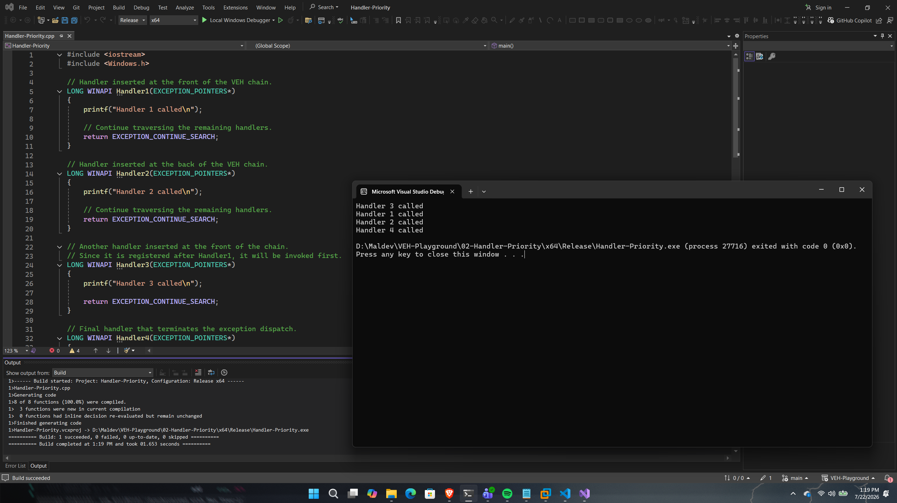

# Handler Priority

## Overview

This proof of concept demonstrates how the registration order and priority of Vectored Exception Handlers (VEHs) affect the order in which they are executed.

Multiple handlers are registered at both the front and back of the VEH chain. When an exception is raised, Windows traverses the handler list according to their registration priority until one of the handlers reports that the exception has been handled.

---

## Implementation

This PoC registers four vectored exception handlers.

Two handlers are inserted at the beginning of the VEH chain using a priority value of `1`, while the remaining handlers are inserted at the end of the chain using a priority value of `0`.

An access violation is then raised using `RaiseException()`, allowing the order of handler execution to be observed.

---

## Code Walkthrough

### Registering multiple handlers

The handlers are registered as follows:

```cpp
Handler1 -> Front
Handler2 -> Back
Handler3 -> Front
Handler4 -> Back
```

Because handlers inserted at the front are placed ahead of existing front handlers, the resulting execution order differs from the registration order.

---

### Exception Dispatch

When the exception is raised, Windows begins traversing the VEH chain.

Each handler returns one of the following values:

- `EXCEPTION_CONTINUE_SEARCH`
- `EXCEPTION_CONTINUE_EXECUTION`

The first three handlers return `EXCEPTION_CONTINUE_SEARCH`, instructing Windows to continue traversing the remaining handlers.

The final handler returns `EXCEPTION_CONTINUE_EXECUTION`, terminating the dispatch process and allowing the application to resume execution.
---

## Execution Flow

```
Register Handlers
        │
        ▼
Raise Exception
        │
        ▼
Handler 3
        │
Continue Search
        ▼
Handler 1
        │
Continue Search
        ▼
Handler 2
        │
Continue Search
        ▼
Handler 4
        │
Continue Execution
        ▼
Program Resumes
```

---

## Expected Output

Figure 2 demonstrates the execution order of the registered vectored exception handlers, illustrating how handler insertion priority determines the traversal order of the VEH chain..

<p align="center">
    
</p>

<p align="center">
<i>Figure 2 - Successful execution of the Handler Priority proof of concept.</i>
</p>

---

## Notes

This PoC demonstrates two important characteristics of Windows VEH:

- Handler priority determines where a handler is inserted within the VEH chain.
- Returning `EXCEPTION_CONTINUE_SEARCH` allows exception dispatch to continue to the next registered handler.
- Returning `EXCEPTION_CONTINUE_EXECUTION` immediately terminates exception dispatch and resumes execution.

Understanding handler ordering is important when multiple VEH callbacks are registered by the same application or by third-party software.

---

## References

- Microsoft – AddVectoredExceptionHandler
- Microsoft – RemoveVectoredExceptionHandler
- Windows Internals