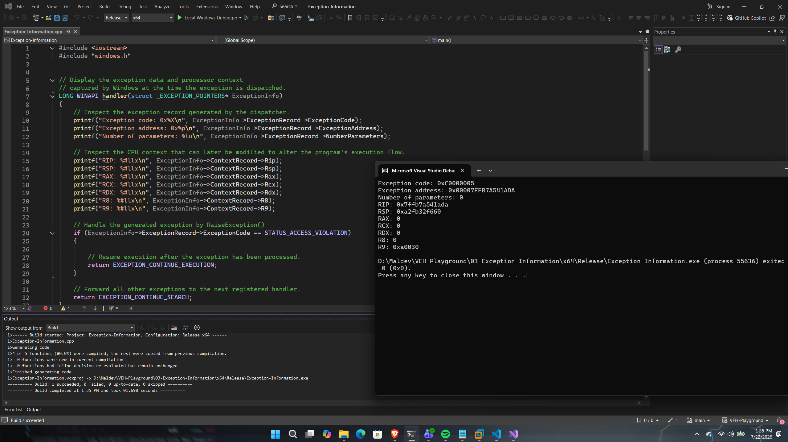

# Exception Information

## Overview

This proof of concept demonstrates how to inspect the information provided by the Windows exception dispatcher through the `EXCEPTION_POINTERS` structure.

When an exception occurs, Windows supplies the registered vectored exception handler with two important structures:

- `EXCEPTION_RECORD`
- `CONTEXT`

Together, these structures provide detailed information about the exception itself and the processor state at the time the exception was raised.

The purpose of this PoC is to introduce the information available during exception dispatch before later PoCs begin modifying processor context and execution flow.

---

## Implementation

The PoC registers a vectored exception handler and intentionally raises an access violation using `RaiseException()`.

Inside the handler, both the exception record and processor context are inspected before the exception is handled.

---

## Code Walkthrough

### Exception Record

The `EXCEPTION_RECORD` structure describes the exception that occurred.

This PoC displays:

- Exception Code
- Exception Address
- Number of Exception Parameters

These values allow applications to determine what exception occurred and where it originated.

---

### Captured Processor Context

The `CONTEXT` structure represents the processor state captured at the moment the exception was dispatched.

This PoC displays several general-purpose registers, including:

- RIP
- RSP
- RAX
- RCX
- RDX
- R8
- R9

Later proof of concepts modify these values to redirect execution flow or alter application behaviour.

---

### Exception Handling

After displaying the captured information, the handler verifies that the generated exception is an access violation.

If the exception matches, the handler returns `EXCEPTION_CONTINUE_EXECUTION`, allowing execution to resume.

All other exceptions are forwarded to the next registered handler using `EXCEPTION_CONTINUE_SEARCH`.

---

## Execution Flow

```
Register VEH
      │
      ▼
Raise Exception
      │
      ▼
Windows Exception Dispatcher
      │
      ▼
Receive EXCEPTION_POINTERS
      │
      ├────────► EXCEPTION_RECORD
      │
      └────────► CONTEXT
                    │
                    ▼
          Display Exception Information
                    │
                    ▼
        Continue Execution
```

---

## Expected Output

Figure 3 demonstrates the information exposed through the EXCEPTION_POINTERS structure, including the exception record and captured processor context at the time of exception dispatch.

<p align="center">
    
</p>

<p align="center">
<i>Figure3 - Successful execution of the Exception Information proof of concept.</i>
</p>

---

## Notes

The `EXCEPTION_POINTERS` structure is one of the most important components of Windows exception handling.

While this PoC only inspects the captured information, subsequent proof of concepts begin modifying the processor context to redirect execution, implement API interception, and perform exception-driven execution techniques.

---

## References

- Microsoft – EXCEPTION_POINTERS
- Microsoft – EXCEPTION_RECORD
- Microsoft – CONTEXT
- Windows Internals