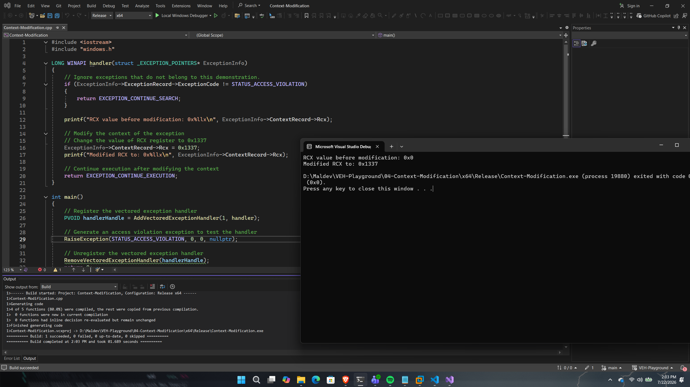

# Context Modification

## Overview

This proof of concept demonstrates how a vectored exception handler can modify the processor context captured by the Windows exception dispatcher.

Rather than simply inspecting the exception information, the handler alters the value of the `RCX` register within the captured `CONTEXT` structure before execution resumes.

The purpose of this PoC is to introduce runtime context modification, a fundamental concept that enables advanced techniques such as execution flow redirection, API interception, and exception-driven code execution.

---

## Implementation

The application registers a vectored exception handler and intentionally raises an access violation using `RaiseException()`.

Once the exception is dispatched, the handler verifies that the exception is an access violation before modifying the captured processor context.

For demonstration purposes, the value stored in the `RCX` register is replaced with `0x1337` before execution resumes.

---

## Code Walkthrough

### Exception Validation

The handler first verifies that the received exception is an access violation.

Any unrelated exceptions are forwarded to the next registered handler using `EXCEPTION_CONTINUE_SEARCH`.

---

### Context Modification

The processor context is accessed through the `ContextRecord` member of the `EXCEPTION_POINTERS` structure.

This PoC modifies the captured value of the `RCX` register:

```cpp
ExceptionInfo->ContextRecord->Rcx = 0x1337;
```

Because the modification occurs before execution resumes, the processor restores the modified register value instead of the original one.

---

### Resuming Execution

After modifying the processor context, the handler returns:

```cpp
EXCEPTION_CONTINUE_EXECUTION
```

This instructs Windows to restore the modified context and continue program execution.

---

## Execution Flow

```
Register VEH
      │
      ▼
Raise Exception
      │
      ▼
Windows Exception Dispatcher
      │
      ▼
Capture Processor Context
      │
      ▼
Modify RCX
      │
      ▼
Return EXCEPTION_CONTINUE_EXECUTION
      │
      ▼
Restore Modified Context
      │
      ▼
Resume Execution
```

---

## Expected Output

Figure 4 demonstrates runtime processor context modification, showing the original RCX register value before being replaced with 0x1337 by the vectored exception handler.

<p align="center">
    
</p>

<p align="center">
<i>Figure4 - Successful execution of the Context-Modification proof of concept.</i>
</p>

---

## Notes

This PoC demonstrates one of the core capabilities of Windows Vectored Exception Handling: the ability to modify the captured processor context before execution resumes.

While only the `RCX` register is modified here for demonstration purposes, the same mechanism can be applied to alter other registers, including the instruction pointer (`RIP`). This capability forms the foundation for several of the more advanced proof of concepts presented later in this repository.

---

## References

- Microsoft – CONTEXT Structure
- Microsoft – EXCEPTION_POINTERS
- Windows Internals