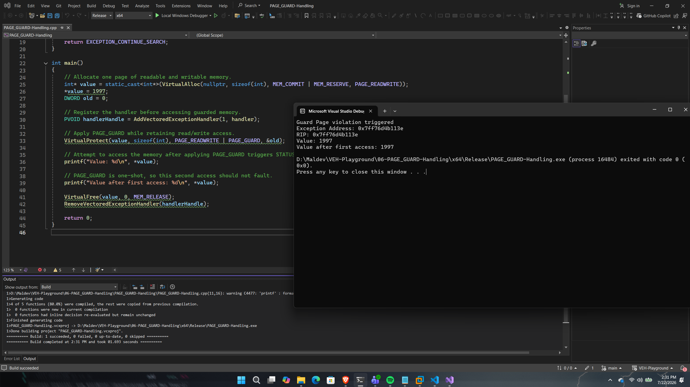

# PAGE_GUARD Handling

## Overview

This proof of concept demonstrates how the `PAGE_GUARD` memory protection can be combined with Windows Vectored Exception Handling (VEH) to intercept memory accesses.

A page is allocated, marked with the `PAGE_GUARD` protection flag, and subsequently accessed. The first access generates a `STATUS_GUARD_PAGE_VIOLATION` exception, allowing the registered vectored exception handler to inspect the exception before execution resumes.

The purpose of this PoC is to introduce guard-page exceptions, which serve as the foundation for more advanced exception-driven techniques presented later in this repository.

---

## Implementation

The application allocates a page of memory using `VirtualAlloc()` and stores an integer value within it.

A vectored exception handler is then registered before the page protection is modified using `VirtualProtect()`, applying the `PAGE_GUARD` attribute while preserving read/write permissions.

The first attempt to read from the guarded page generates a guard-page violation, transferring execution to the registered vectored exception handler.

After the handler returns `EXCEPTION_CONTINUE_EXECUTION`, Windows automatically removes the `PAGE_GUARD` attribute, allowing the faulting instruction to be retried successfully.

---

## Code Walkthrough

### Memory Allocation

The application allocates a readable and writable memory region using `VirtualAlloc()`.

This region serves as the guarded memory used throughout the demonstration.

---

### Applying PAGE_GUARD

The allocated memory is protected using:

```cpp
VirtualProtect(
    value,
    sizeof(int),
    PAGE_READWRITE | PAGE_GUARD,
    &old
);
```

The `PAGE_GUARD` modifier causes the first access to the page to generate a `STATUS_GUARD_PAGE_VIOLATION` exception.

---

### Handling the Guard Page Violation

When the guarded memory is accessed, Windows dispatches a guard-page exception before completing the memory operation.

The vectored exception handler detects the exception, displays information about the fault, and returns:

```cpp
EXCEPTION_CONTINUE_EXECUTION
```

Windows then retries the instruction that originally triggered the exception.

---

### One-Shot Behaviour

`PAGE_GUARD` is a one-shot protection mechanism.

After the first access, Windows automatically clears the `PAGE_GUARD` attribute from the page.

As a result, subsequent accesses complete normally without generating additional exceptions unless the protection is explicitly restored.

---

## Execution Flow

```
Allocate Memory
       │
       ▼
Apply PAGE_GUARD
       │
       ▼
Access Guarded Page
       │
       ▼
STATUS_GUARD_PAGE_VIOLATION
       │
       ▼
Vectored Exception Handler
       │
       ▼
Return EXCEPTION_CONTINUE_EXECUTION
       │
       ▼
Windows Clears PAGE_GUARD
       │
       ▼
Retry Original Instruction
       │
       ▼
Memory Read Completes
```

---

## Expected Output

Figure 6 demonstrates generating STATUS_GUARD_PAGE_VIOLATION during the first access to guarded memory, showing the exception information captured by the vectored exception handler before execution resumes.

<p align="center">
    
</p>

<p align="center">
<i>Figure6 - Successful execution of the PAGE_GUARD-Handling proof of concept.</i>
</p>

---

## Notes

Unlike the previous proof of concepts, the exception is not generated manually using `RaiseException()`. Instead, it originates from the Windows memory manager when the guarded page is accessed.

One important characteristic of `PAGE_GUARD` is that it is automatically removed after the first successful access. This one-shot behaviour makes guard pages particularly useful for implementing memory breakpoints, execution monitoring, and exception-driven execution techniques that temporarily intercept memory accesses before allowing the original instruction to continue.

Later proof of concepts build upon this behaviour by dynamically restoring page protections and using repeated guard-page violations to control execution flow.

---

## References

- Microsoft – VirtualProtect
- Microsoft – VirtualAlloc
- Microsoft – PAGE_GUARD Memory Protection
- Windows Internals