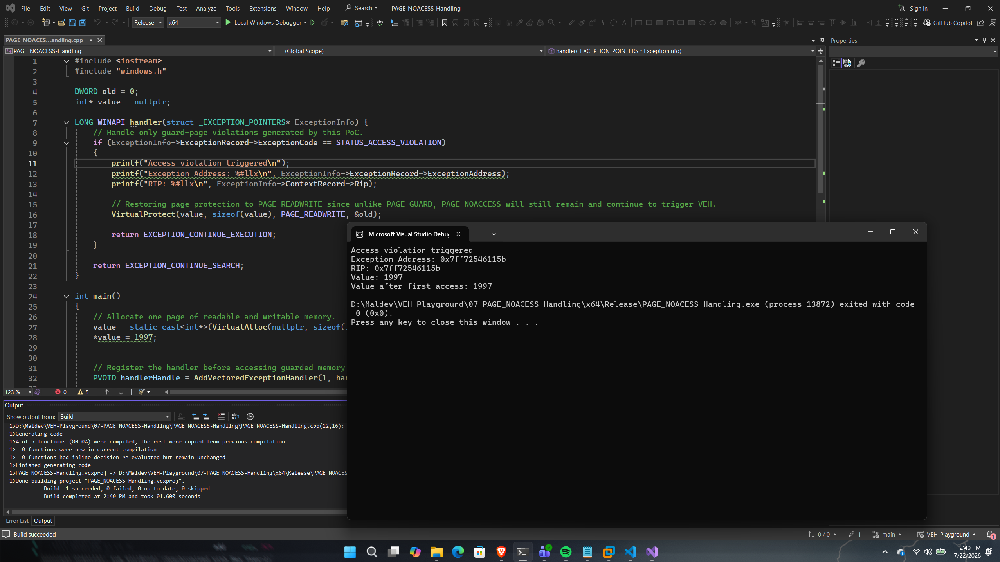

# PAGE_NOACCESS Handling

## Overview

This proof of concept demonstrates how the `PAGE_NOACCESS` memory protection can be combined with Windows Vectored Exception Handling (VEH) to intercept invalid memory accesses.

Unlike `PAGE_GUARD`, which automatically clears itself after the first access, pages protected with `PAGE_NOACCESS` remain inaccessible until their protection is explicitly restored. As a result, every attempted access generates a `STATUS_ACCESS_VIOLATION` exception.

The purpose of this PoC is to demonstrate how a vectored exception handler can dynamically restore page permissions, allowing execution to continue after an access violation.

---

## Implementation

The application allocates a readable and writable memory region using `VirtualAlloc()` before registering a vectored exception handler.

The page protection is then changed to `PAGE_NOACCESS` using `VirtualProtect()`. When the application attempts to read from the protected page, Windows raises a `STATUS_ACCESS_VIOLATION` exception.

Inside the vectored exception handler, the page protection is restored to `PAGE_READWRITE`, allowing the faulting instruction to be retried successfully when execution resumes.

---

## Code Walkthrough

### Memory Allocation

The application allocates a readable and writable memory region using `VirtualAlloc()`.

This memory region is later protected using `PAGE_NOACCESS`.

---

### Applying PAGE_NOACCESS

The allocated page is protected using:

```cpp
VirtualProtect(
    value,
    sizeof(int),
    PAGE_NOACCESS,
    &old
);
```

Unlike `PAGE_GUARD`, this protection completely prevents all read and write operations until the page protection is explicitly modified.

---

### Handling the Access Violation

When the protected page is accessed, Windows generates a `STATUS_ACCESS_VIOLATION` exception.

Inside the vectored exception handler, the original page permissions are restored:

```cpp
VirtualProtect(
    value,
    sizeof(int),
    PAGE_READWRITE,
    &old
);
```

After restoring the page permissions, the handler returns:

```cpp
EXCEPTION_CONTINUE_EXECUTION
```

Windows retries the original instruction, which now succeeds because the page is once again readable.

---

## Execution Flow

```
Allocate Memory
       │
       ▼
Apply PAGE_NOACCESS
       │
       ▼
Access Protected Memory
       │
       ▼
STATUS_ACCESS_VIOLATION
       │
       ▼
Vectored Exception Handler
       │
       ▼
Restore PAGE_READWRITE
       │
       ▼
Return EXCEPTION_CONTINUE_EXECUTION
       │
       ▼
Retry Original Instruction
       │
       ▼
Memory Read Completes
```

---

## Expected Output

Figure 7 demonstrates generating STATUS_ACCESS_VIOLATION when accessing a PAGE_NOACCESS memory region, followed by restoration of the original page protection inside the vectored exception handler before execution resumes.

<p align="center">
    
</p>

<p align="center">
<i>Figure7 - Successful execution of the PAGE_NOACCESS-Handling proof of concept.</i>
</p>

---

## Notes

Unlike `PAGE_GUARD`, `PAGE_NOACCESS` is **not** a one-shot protection mechanism.

The protected page remains inaccessible until its protection is explicitly restored using `VirtualProtect()`. This behaviour provides complete control over when memory becomes accessible again, making `PAGE_NOACCESS` particularly useful for techniques that require deterministic interception of memory accesses.

Later proof of concepts build upon this behaviour by repeatedly changing page protections to temporarily expose memory before hiding it again.

---

## References

- Microsoft – VirtualProtect
- Microsoft – VirtualAlloc
- Microsoft – Memory Protection Constants
- Windows Internals