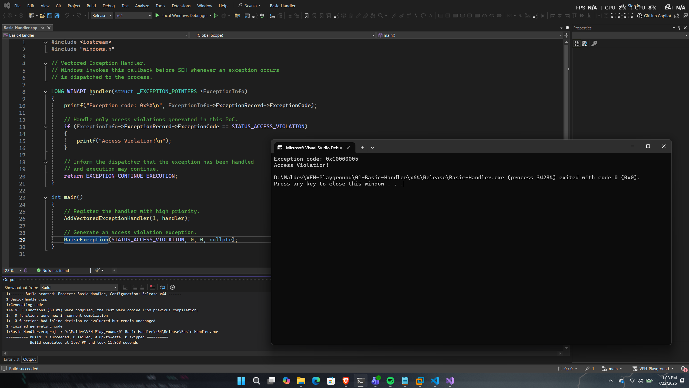

# Basic Handler

## Overview

This proof of concept demonstrates the minimum implementation required to use Windows Vectored Exception Handling (VEH).

A vectored exception handler is registered, an access violation is raised manually, and the registered callback intercepts the exception before allowing execution to continue.

The purpose of this PoC is to introduce the basic structure of a VEH application without modifying execution flow or memory protections.

---

## Implementation

The implementation consists of three simple steps:

1. Register a vectored exception handler.
2. Trigger an access violation using `RaiseException()`.
3. Handle the exception inside the registered callback.

---

## Code Walkthrough

### Registering the handler

The application registers a vectored exception handler using:

```cpp
AddVectoredExceptionHandler(1, handler);
```

The first parameter specifies the handler priority. Passing `1` places the handler at the beginning of the vectored exception handler list.

---

### Triggering the exception

Instead of relying on an invalid memory access, this PoC intentionally raises an access violation using:

```cpp
RaiseException(
    STATUS_ACCESS_VIOLATION,
    0,
    0,
    nullptr
);
```

This guarantees deterministic behaviour and allows the handler to be tested consistently.

---

### Handling the exception

When the exception is dispatched, Windows invokes the registered callback.

The handler:

- Retrieves the exception code
- Prints it
- Checks whether it is an access violation
- Returns `EXCEPTION_CONTINUE_EXECUTION`

Returning `EXCEPTION_CONTINUE_EXECUTION` informs the Windows exception dispatcher that the exception has been handled.

---

## Expected Output

```

```

---

## Notes

This PoC intentionally avoids:

- Context modification
- RIP redirection
- PAGE_GUARD
- PAGE_NOACCESS
- API interception

Its sole purpose is to demonstrate the minimum structure required to register and execute a vectored exception handler.

Later PoCs expand upon this foundation by modifying processor context, intercepting execution flow, and leveraging memory protection exceptions.

---

## References

- Microsoft – AddVectoredExceptionHandler
- Microsoft – RaiseException
- Windows Internals