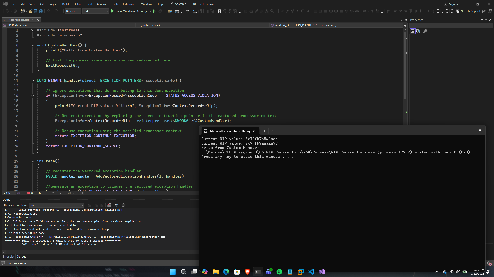

# RIP Redirection

## Overview

This proof of concept demonstrates how a vectored exception handler can redirect program execution by modifying the captured instruction pointer (`RIP`) within the processor context.

When an access violation is dispatched, the handler replaces the saved instruction pointer with the address of a custom function before returning `EXCEPTION_CONTINUE_EXECUTION`. As a result, execution resumes at the new location instead of the instruction that originally generated the exception.

The purpose of this PoC is to demonstrate one of the most powerful capabilities of Windows Vectored Exception Handling: runtime execution flow manipulation.

---

## Implementation

The application registers a vectored exception handler and intentionally raises an access violation using `RaiseException()`.

Once the exception is dispatched, the handler verifies that the exception is an access violation before replacing the captured instruction pointer (`RIP`) with the address of a custom function.

After modifying the processor context, the handler returns `EXCEPTION_CONTINUE_EXECUTION`, allowing Windows to restore the modified context and resume execution at the redirected location.

---

## Code Walkthrough

### Exception Validation

The handler first verifies that the received exception is an access violation.

Any unrelated exceptions are forwarded to the next registered handler using `EXCEPTION_CONTINUE_SEARCH`.

---

### Redirecting the Instruction Pointer

The captured processor context is accessed through the `ContextRecord` member of the `EXCEPTION_POINTERS` structure.

Instead of modifying a general-purpose register, this PoC replaces the saved instruction pointer:

```cpp
ExceptionInfo->ContextRecord->Rip =
    reinterpret_cast<DWORD64>(&CustomHandler);
```

By modifying `RIP`, execution resumes at the specified function rather than the instruction that originally generated the exception.

---

### Resuming Execution

After updating the instruction pointer, the handler returns:

```cpp
EXCEPTION_CONTINUE_EXECUTION
```

Windows restores the modified processor context and transfers execution directly to the custom handler.

In this demonstration, the custom handler prints a message before terminating the process using `ExitProcess()`.

---

## Execution Flow

```
Register VEH
      │
      ▼
Raise Exception
      │
      ▼
Windows Exception Dispatcher
      │
      ▼
Capture Processor Context
      │
      ▼
Modify RIP
      │
      ▼
Return EXCEPTION_CONTINUE_EXECUTION
      │
      ▼
Thread resumes using modified context
      │
      ▼
Execute Custom Handler
      │
      ▼
Exit Process
```

---

## Expected Output

Figure 5 demonstrates execution flow redirection by replacing the captured instruction pointer (RIP) with the address of a custom handler before execution resumes.

<p align="center">
    
</p>

<p align="center">
<i>Figure5 - Successful execution of the RIP-Redirection proof of concept.</i>
</p>

---

## Notes

Unlike the previous proof of concept, which modified a general-purpose register, this implementation alters the captured instruction pointer (`RIP`).

Changing the instruction pointer allows execution to be redirected to an arbitrary location before the processor resumes execution. This capability forms the basis of numerous exception-driven execution techniques, including API interception, shellcode dispatch, and advanced execution flow manipulation demonstrated in later proof of concepts.

---

## References

- Microsoft – CONTEXT Structure
- Microsoft – EXCEPTION_POINTERS
- Windows Internals